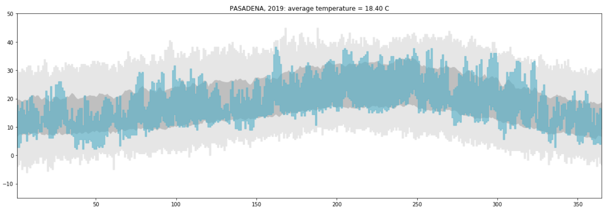
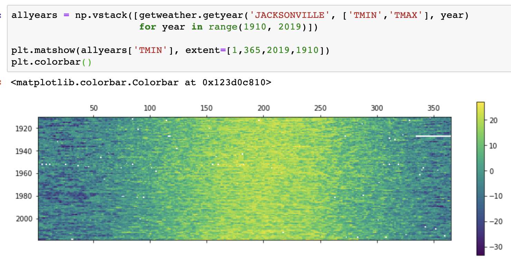
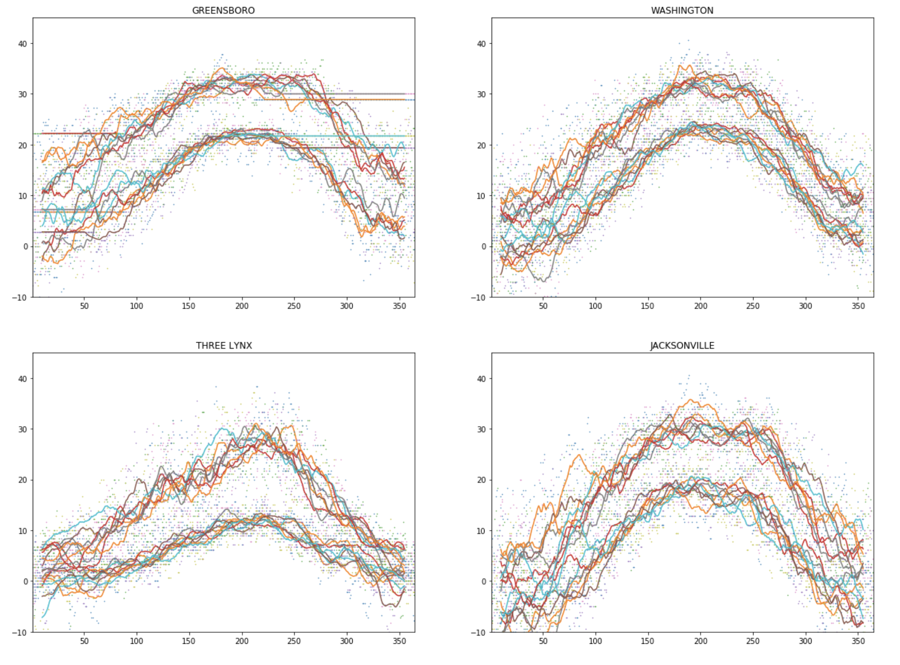
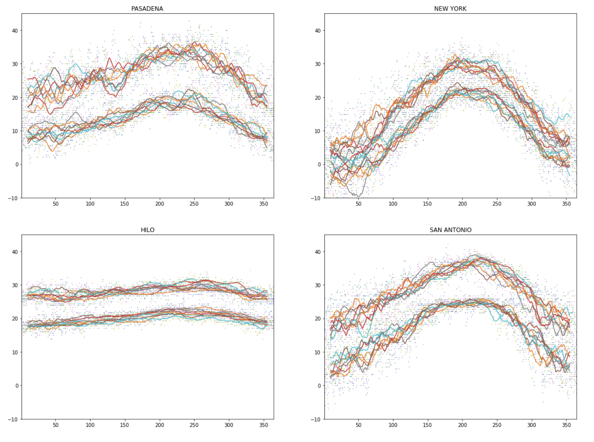

# Weather-Analysis

View project --> https://nbviewer.jupyter.org/github/gianmillare/Weather-Analysis/blob/master/weather_analysis.ipynb
Analyzing the weather and climate patterns using data from https://www.ncdc.noaa.gov/cdo-web/search?datasetid=GHCND
Inspired by Michele Vallisneri and LinkedIn Learning's 'Python Data Analysis' Course.

------------------------------------------------------------------------------------------------

Although the concept of this project is simple (i.e. analyze climate data of US), I wanted to venture further into the analyses and ask 'why?'. Is there a difference in weather between California, New York, and Florida? What about states that are right next to each other like California and Oregon?

In this project, I attempt to answer these questions using various techniques taught by M. Vallisneri. Throughout this project, I will explain how I came to a conclusion, how I plotted the datapoints, and what questions arose after accomplishing a plot.

PLEASE NOTE: I completed a similar project like this titled 'California Weather DV'. In that project I practiced data visualizaiton techniques. However, in THIS project, I dive deeper into the question and implemented more advanced data analysis skills.

------------------------------------------------------------------------------------------------

Below is a preview of the project:

This is a version of one of the plots I create in the project. This takes record temperature mins and maxes and compares them to a specific city and day of the year.

------------------------------------------------------------------------------------------------

This chart shows the changes of yearly temperatures between the years 1910-2019. More versions of this plot are created for other cities.

------------------------------------------------------------------------------------------------

A quick look at the temperatures of North Carolina, Oregon, Iowa, and Florida.

------------------------------------------------------------------------------------------------

